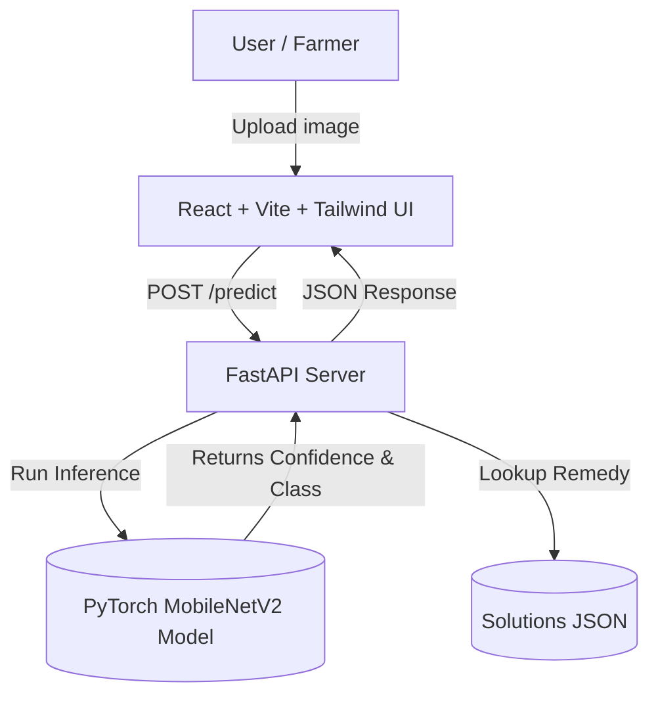

# 🌱 LeafSense AI - Plant Disease Detection System


An enterprise-grade, full-stack web application designed to automatically detect and diagnose plant leaf diseases using artificial intelligence. **LeafSense AI** empowers farmers, botanists, and gardeners with instant analysis and verified remedies based on state-of-the-art Deep Learning models.

---

## ✨ Features
- **Instant AI Inference:** Upload an image and get predictions powered by MobileNetV2.
- **Dynamic Remedies:** Automatically maps detected diseases to validated treatments.
- **Multi-language Support:** Complete UI available in English and Tamil.
- **Scan History:** Local persistence of past scans and results to help monitor crop health.
- **Modern UI/UX:** Responsive, performant, and beautifully designed with Tailwind CSS.
- **Production Ready:** Scalable FastAPI backend natively configured for cloud hosting.

---

## 🏗️ Architecture Stack

- **Frontend**: React (TypeScript), Vite, Tailwind CSS, Lucide Icons.
- **Backend**: Python, FastAPI, Uvicorn, Python-Multipart.
- **Deep Learning**: PyTorch, Torchvision, PlantVillage standard architecture mapping.

---

## 🚀 Local Setup Guide

Follow these steps to run **LeafSense AI** locally. Ensure you have `Node.js` (v18+) and `Python` (3.9+) installed.

### 1. Model Preparation (Optional)
The pre-trained model and test scripts are in the `/model` directory.
```bash
cd model
pip install -r requirements.txt
python train.py
```
*(Note: A `leaf_disease_model.pt` is generated for the backend.)*

### 2. Backend Server
Start the high-performance FastAPI server running on port `8000`.
```bash
cd backend
python -m venv venv
venv\Scripts\activate   # Or `source venv/bin/activate` on Mac/Linux
pip install -r requirements.txt
uvicorn main:app --reload --port 8000
```

### 3. Frontend Application
In a separate terminal, start the UI.
```bash
cd frontend
npm install
npm run dev
```
Open `http://localhost:5173` in your browser.

---

## 🌐 API Documentation

### `GET /health`
Verifies if the platform and inference engine are healthy.
**Response:**
```json
{
  "status": "OK",
  "model_loaded": true
}
```

### `POST /predict`
Upload an image of a leaf for prediction.
**Body:** `multipart/form-data` containing `file` (Image).
**Response:**
```json
{
  "disease": "Apple___Apple_scab",
  "confidence": 98.45,
  "solution": "Remove and destroy infected leaves. Use appropriate fungicides if the disease is severe."
}
```

---

## 🌩️ Deployment Configuration

### Frontend (vercel)
Push your code to GitHub and import the `/frontend` directory to Vercel. 
- **Framework Preset**: Vite
- **Build Command**: `npm run build`
- **Output Directory**: `dist`

### Backend (Render / Railway)
Deploy the `/backend` directory to Render or Railway.
- **Environment**: Python 3.10+
- **Build Command**: `pip install -r requirements.txt`
- **Start Command**: `uvicorn main:app --host 0.0.0.0 --port $PORT`

*(Make sure to update CORS settings in `main.py` depending on your deployed frontend origin.)*

---

> Built with ❤️ by the AI Engineering Team.
